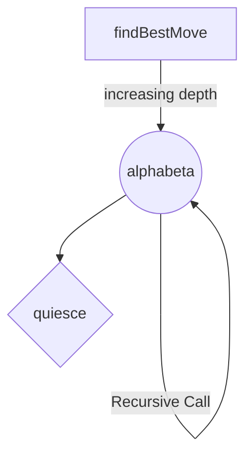
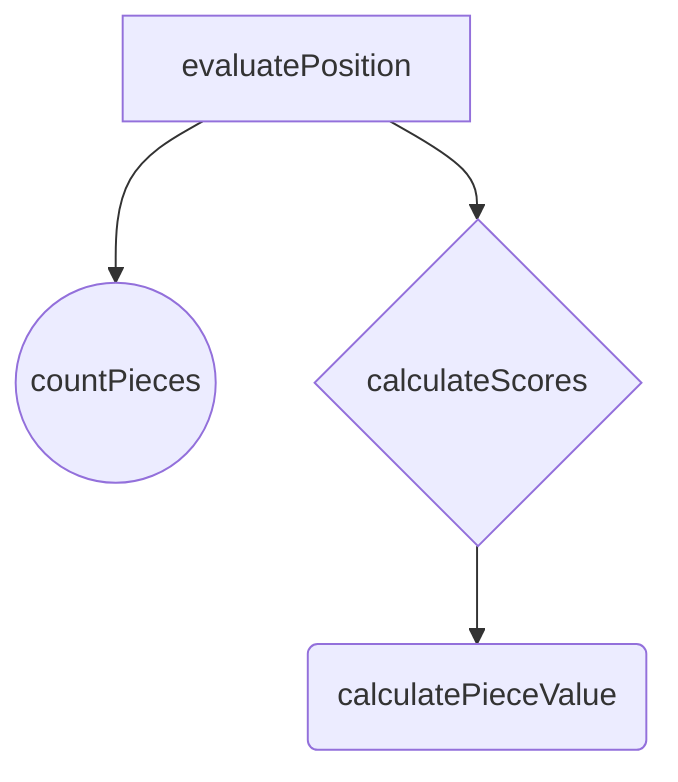

# **Chess AI**

## Basic Idea

The code implements a **chess-playing algorithm** using **iterative deepening alpha-beta search**. It evaluates potential moves using **negamax with alpha-beta pruning**, optimizing move ordering by prioritizing captures. The algorithm includes a **quiescence search** to handle tactically active positions, ensuring more accurate evaluations. The iterative deepening approach progressively explores the game tree at increasing depths to balance computation time and accuracy. **The goal** is to **find the best move** for a given chess game state.

## Project Structure

The code can be divided into three main sections: _move calculation_, _position evaluation and piece evaluation tables_

## Move calculation

The three main functions are:

- findBestMove()
- alphabeta()
- quiesce()

**Function Call Hierarchy:**



`findBestMove()` implements iterative deepening search and calls alphabeta
(simplified)

```
   def findBestMove(self, gs):
        # initialize values
        ...
        # start of iterative deepening search
        while True:
            for move in optimizedMoves:
                # start with bestMove after every iteration
                ...
                # make move and update gs.stalemate
                ...
                # we don't want draws
                ...
                # calculate
                score = alphabeta(gs)
                # update values accordingly
                ...
                # undo move
               ...
            # increase calculation depth and clear queue
            ...
```

`alphabeta()` implements negamax algorithm (variant of minimax which negates the value when switching) and calls quiesce() (simplified)

```
    def alphabeta(self, board, alpha, beta, depthleft):
        # Initialize the best score with a low value.

        # Perform a quiesce search when the recursion depth reaches zero.
       if (depthleft == 0):
            return self.quiesce(board, alpha, beta)
        # Optimize the order of moves, prioritizing captures.

        for move in optimizedMoves:
            # make move and update board.stalemate

            # We don't want draws

            # calculating score using negamax approach (negating value)
            score = -self.alphabeta(board, -beta, -alpha, depthleft - 1)

            # undo move

            # prune, if possible

        return bestscore
```

`quiesce()` handles tactically active positions, ensuring more accurate evaluations (simplified)

```
    def quiesce(self, board, alpha, beta):
        # Evaluate the current board position.
        stand_pat = self.evaluatePosition(board)
        # prune, if possible
        # update alpha
        # Optimize the order of moves, prioritizing captures.
        for move in optimizedMoves:
             if move.isCapture:
                # make move
             score = -self.quiesce(board, -beta, -alpha)
             # undo move
             # prune, if possible
             # update alpha (with score)

        return alpha
```

## Position evaluation

The four main functions are:

- evaluatePosition()
- countPieces()
- calculateScores()
- calculatePieceValue()

**Function Call Hierarchy:**



`evaluatePosition` calculates the positional score of a chess game state, considering material balance, piece distribution, and game state, utilizing a transposition table for caching. (simplified)

```
   def evaluatePosition(self, gs):
        # create custom Hash
        board_hash = self.custom_hash(gs)

        # check for checkMate/staleMate/draw

        # count Pieces
        piece_counts = self.countPieces(gs.board)

        # material and piece_scores
        scores = self.calculateScores(piece_counts, gs)

        # sum of all scores
        eval = scores['material'] + scores['pawn'] + scores['knight'] +
            scores['bishop'] + scores['queen'] + scores['king']

        # depending on player color
        return (-/+)eval
```

The `countPieces` function tallies the number of each chess piece on the board, categorizing them by color and type, and returns the counts in a dictionary.

```
    def countPieces(self, board):
        # dictionary to count pieces
        piece_counts = {
            'wK': 0, 'wQ': 0, 'wB': 0, 'wN': 0, 'wp': 0,
            'bK': 0, 'bQ': 0, 'bB': 0, 'bN': 0, 'bp': 0,
        }
        # go through each string in board
        for square in board:
            match square:
                case '--':
                    continue
                case 'piece_name':
                    piece_counts['piece_name'] += 1

        return piece_counts
```

The `calculateScores` function computes various scores, including material and individual piece scores, based on the counts of chess pieces and the current state of the game, returning the scores in a dictionary.

```
    def calculateScores(self, piece_counts, gs):

        # material score

        # individual pieces score

        # Return a dictionary containing the scores
        scores = {
            'material': material,
            'piece_name': piece_score
        }

        return scores
```

The `calculatePieceValue` function sums up individual score values for a given chess piece ('bp', 'bB', etc.) based on its type, color, and the current state of the game, returning the total score for the piece. In the endgame, the function considers a different table for the king.

```
    def calculatePieceValue(self, gs, piece_name):

        # get piece indices for black and white
        piece_indices = [i/squareMirror(i) for i, piece in enumerate(
                gs.board) if piece == piece_name]

        # sum up all piece values using piece_tables
        piece_value = sum(
                self.piece_tables['piece_name'][i] for i in piece_indices)

        return piece_value
```

## **Piece evaluation tables**

The piece_tables represent evaluation tables for each chess piece, assigning positional values to individual squares on the chessboard. These values reflect the strategic importance of each square for the respective piece type, aiding in evaluating the overall positional strength of the pieces during the game.

```
        self.piece_tables = {  # dictionary for each piece to evaluate position
            'p': [ # pawns need to go forward
                0, 0, 0, 0, 0, 0,
                5, 10, -20, -20, 10, 5,
                5, 10, 20, 20, 10, 5,
                0, 10, 20, 20, 10, 0,
                10, 20, 30, 30, 20, 10,
                50, 50, 50, 50, 50, 50
            ],
            'n': [ # knights are the most effective in center
                -20, -30, -30, -30, -30, -20,
                -30, 10, 20, 20, 10, -30,
                -30, 10, 30, 30, 10, -30,
                -30, 15, 30, 30, 15, -30,
                -30, 10, 15, 15, 10, -30,
                -50, -30, -30, -30, -30, -50
            ],
            'b': [ # bishops are more effective in center
                -20, -10, -10, -10, -10, -20,
                -10, 10, 10, 10, 10, -10,
                -10, 10, 10, 10, 10, -10,
                -10, 5, 10, 10, 5, -10,
                -10, 5, 10, 10, 5, -10,
                -20, -10, -10, -10, -10, -20
            ],
            'q': [ # queens are more effective in center (apart from check)
                -20, -10, -5, -5, -10, -20,
                -10, 5, 5, 5, 5, -10,
                0, 5, 5, 5, 5, -5,
                -5, 5, 5, 5, 5, -5,
                -10, 5, 5, 5, 5, -10,
                -20, -10, -5, -5, -10, -20
            ],
            'k': [ # king should be safe in opening/middlegame
                20, 10, 0, 0, 10, 20,
                -10, -20, -20, -20, -20, -10,
                -20, -30, -40, -40, -30, -20,
                -30, -40, -50, -50, -40, -30,
                -30, -40, -50, -50, -40, -30,
                -30, -40, -50, -50, -40, -30
            ],
            'k-endgame': [ # king should help pawns in endgame
                0, 0, 0, 0, 0, 0,
                0, 0, 0, 0, 0, 0,
                0, 10, 10, 10, 10, 0,
                0, 10, 10, 10, 10, 0,
                0, 0, 0, 0, 0, 0,
                0, 0, 0, 0, 0, 0
            ]
        }
```

## Feedback for future iterations

First of all I really loved the idea of building a Chess AI, learning about so many different concepts of game calculation like minimax, iterative deepening search, transposition tables, hashing etc.

But what made the whole process from really fun in the beginning to quite frankly exhausting and frustrating in the end, was the game server...

Each time you upload your agent, you have to wait from (if you're lucky 30 mins to multiple hours until you can check your agent playing against MrNovice and MrExpert. It's really nice to have the competition, but for most people the priority was to win against MrNovice and MrExpert to get the points, but each time you fix a bug, you have to wait multiple hours to get to check your agent again, is soo tiring. I hope this gets fixed in the future.

